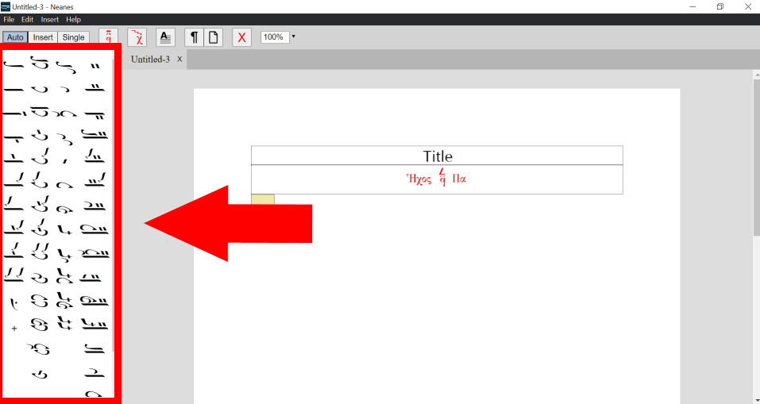
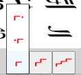
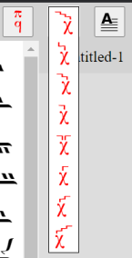
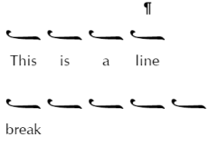
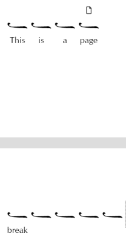
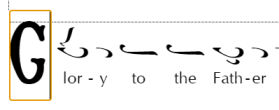
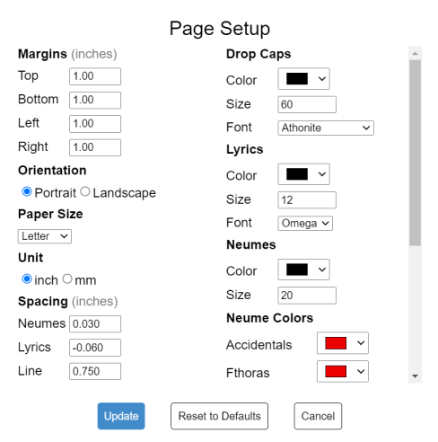

# Guide

## Table of Contents

[[toc]]

## Creating a new score

To create a new score, use the file menu: `File -> New`. This will give you a template containing a title and a mode key.

## Updating the title

To update the title, click on it and begin typing.

While editing the title, a toolbar will appear at the bottom of the window. This toolbar can be used to change the size, color, font, and alignment of the text.

## Updating the mode key

To update the mode key, double click the current mode key to open the mode key dialog. You can also launch the dialog by clicking the mode key once, and pressing `Change Key` in the toolbar at the bottom of the window.

In the mode key dialog, select the mode on the left, and then pick the appropriate signature on the right. Most common signatures should be present in the dialog. Many signatures can be written in several different ways, and not all variations have been included. If a signature is missing, request it by [opening an issue](https://github.com/danielgarthur/neanes/issues/new).

While the mode key is selected, a toolbar at the bottom the screen will be visible that allows you to change the color, size, and alignment of the key.

## Entering Neumes

Quantitative neumes are inserted by clicking the desired neume in the panel on the left side of the window.

Supporting neumes such as fthoras, gorgons, accidentals, etc. can be inserted by using the toolbar that appears on the bottom of the screen when a neume is selected.

Some buttons in this toolbar will open a menu containing more options. To operate this menu, click and hold the mouse button, select the desired neume, and then release the mouse button.

### Martyria

To insert a martyria, use the martyria button in main toolbar. The note and root sign of the martyria are automatically calculated based on the mode key and fthoras placed above neumes. If the melody leaves the range generally used by traditional Byzantine Chant, the martyria will not display properly.

#### Overrides

In some cases, you may wish to override the note or scale of the martyria. For example, sticheraric hymns of the plagal of the first mode usually end in Δη, but the next hymn in the sequence will begin on Πα. In this case, a martyria of Πα may be written at the end of the first hymn, even though the last note is Δη.

To override a martyria, uncheck the `Auto` checkbox in the martyria toolbar and choose the desired note or scale.

### Tempo

To insert a tempo marker, click and hold the tempo button in the main tool bar.

This will open a menu of tempo markers. While continuing to hold the mouse button down, select the desired tempo marker and then release the mouse button.

## Entry Modes

There are three modes of neume entry.

- Auto Mode
- Insert Mode
- Single Edit Mode

To change the entry mode, click the `Auto`, `Insert`, or `Single` buttons in the main toolbar.

### Auto Mode

When creating a new score, you will most likely want to use Auto Mode. In Auto Mode, clicking a quantitative neume will advance the cursor to the right and set the neume. When a supporting neume is clicked, such as a gorgon or a fthora, the neume will be added to the currently selected neume, without advancing the cursor.

This mode allows you to quickly enter neumes by clicking the quantitative neumes in left panel. You can either enter all the quantitative neumes rapidly, and then go back and add the gorgon, fthora, etc., or you can click a quantitative neume, click the gorgon, click another quantitative neume, etc.

If you make a mistake, and wish to go back a character, press the left arrow key to move the cursor back to the left and continue entering neumes. The mistake will be overwritten.

#### Example

### Insert Mode

If you need to insert neumes in the middle of the score, then you should use Insert Mode. This mode functions similarly to Auto Mode, except neumes are not overwritten, but are instead inserted to the right of the current cursor position.

#### Example

### Single Edit Mode

In Single Edit Mode, clicking a quantitative neume updates the currently selected neume without advancing the cursor. This can be used to correct a single mistake by clicking directly on the neume and changing it.

#### Example

## Removing Neumes and Other Elements

To remove a neume, text box, mode key, or other element, select it and press the `Delete` button in the main toolbar.

## Inserting Lyrics

To insert lyrics, click on the space just below a neume and begin typing.

- To move to the next lyric box, press `Space`, `Tab`, or `Ctrl + Right Arrow`.
- To insert an actual space character, press `Ctrl + Space`.
- To move to the previous lyric box, press `Ctrl + Left Arrow`.
- If you press the `Left Arrow` key while the cursor is at the beginning of a lyric box, then the cursor will move to the previous lyric box.
- If you press the `Right Arrow` key while the cursor is at the end of a lyric box, then the cursor will move to the next lyric box.

### Melismas

To create a melisma, end your lyrics with an underscore or hyphen (`_` or `-`). To continue the melisma, set the lyrics for each neume in the melisma to a single underscore or hyphen. The full melisma will be drawn for you.

## Page Breaks and Line Breaks

To insert a page break or a line break, click the neume that you want the break to occur after, and press the `Page Break` or `Line Break` button in the main toolbar. To remove the page or line break, highlight the element with the break, and press the button page or line break button again.

### Line Break

A small symbol will appear above the neume to indicate the break.

### Page Break

A small symbol will appear above the neume to indicate the break.

## Drop Caps

Drop Caps may be inserted through the main menu by clicking `Insert -> Drop Cap` or by pressing the `Drop Caps` button in the main toolbar.

Edit the drop cap by typing the desired letter.

## Saving the score

To save your file to the disk, click `File -> Save` or `File -> Save As` in the main menu. The main file extension is `.byz`. It is a compressed format that reduces the file size. There is another extension, `.byzx`, which is an uncompressed file. It is mainly used for development and debugging.

## Export to PDF

To export the score to PDF, click `File -> Export to PDF` in the main menu.

## Print

To print, click `File -> Print` in the main menu.

## Page Setup

To open the page setup dialog, click `File -> Page Setup` in the main menu. This dialog allows you to customize many details about the page.

Most of the options are self-explanatory, but a few are not.

### Spacing

#### Neumes

The amount of extra space that is inserted between neumes. Some scores look better with more or less spacing.

#### Lyrics

The distance between the neumes and lyrics. This number can be negative, in which case the lyrics will be drawn closer to the neumes than they would be by default.

#### Line

Increasing this number will increase the space between lines.

#### Hyphens

The amount of space between the hyphens that are automatically drawn between melismatic syllables. To draw more hyphens between syllables, decrease this number. To draw less hyphens between syllables, increase this number.

