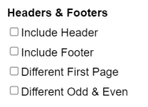
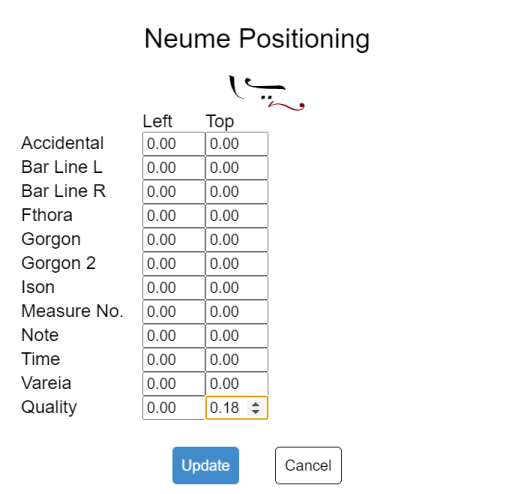

# Advanced

## Headers & Footers

To insert a header or footer, use the file menu: `Insert > Headers & Footers > Header` or `Insert > Headers & Footers > Footer`.

Headers and footers may also be turned on and off in the page setup dialog, whih is accessed through the main menu: `File > Page Setup`.

In the page setup dialog, you can control whether the first page has a different header and footer than the rest of the document, as well as whether odd and even pages have different headers.

### Page Numbers

To insert a page number in the header, type `$p`. When the document is printed, the token `$p` will be replaced with the correct page number in the header/footer of each page.

### Other Tokens

Several other tokens are available. Below is a list of currently supported tokens.

| Token | Description                   |
| ----- | ----------------------------- |
| `$p`  | Page Number                   |
| `$n`  | Number of Pages               |
| `$f`  | File Name (without extension) |
| `$F`  | File Path                     |

## Fine-tuning Neume Positions

Sometimes the font is unable to properly position neumes when there are multiple supporting neumes. To fix collisions, either double-click the neume or click the `Positioning` button in the neume toolbar.

This will open the neume positioning dialog.

You can move neumes by either clicking a drag handle (the small blue box near the neume) and moving the mouse, or by editing the values in the `Left` and `Top` input boxes.

- To move a neume **left**, **decrease** the `Left` number.
- To move a neume **right**, **increase** the `Left` number.
- To move a neume **up**, **decrease** the `Top` number.
- To move a neume **down**, **increase** the `Top` number.

In the below example, we have corrected the collision between the heteron and the dipli.

